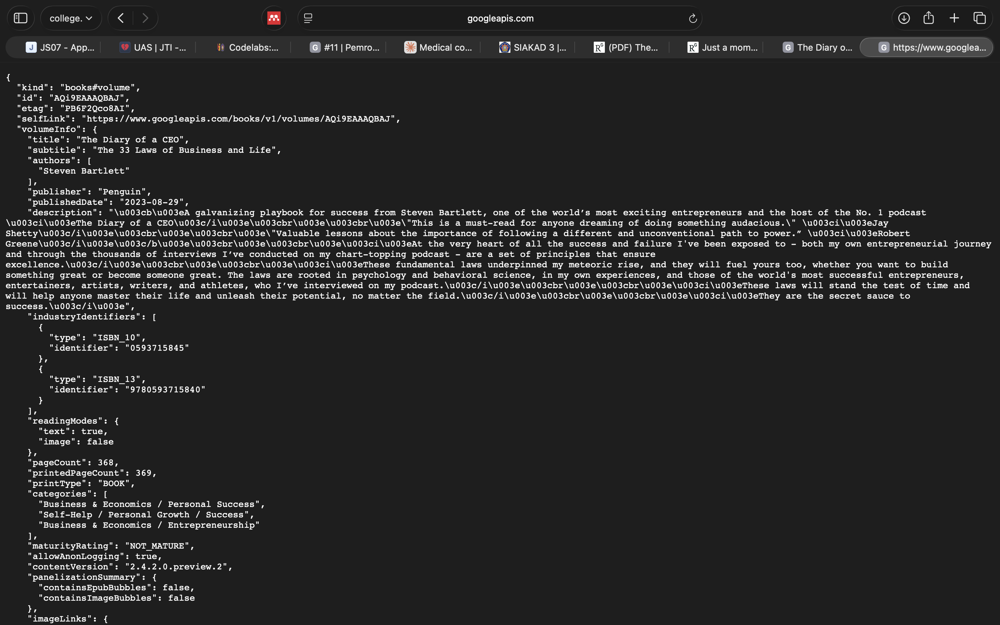
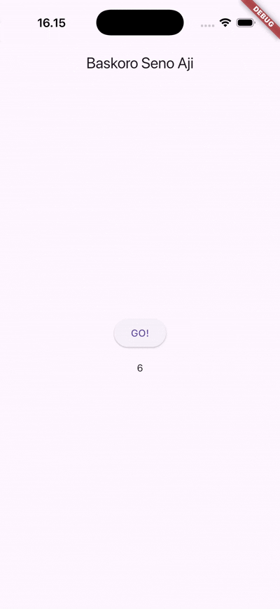
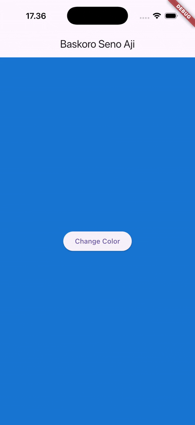
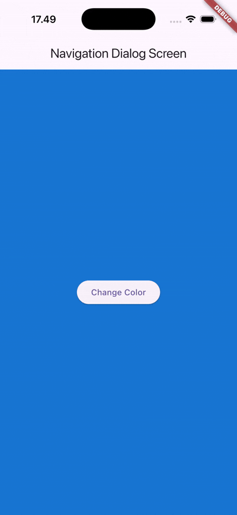

## **Praktikum 1 Mengunduh Data dari Web Service (API)**
**Soal 2**

**Soal 3**
- Jelaskan maksud kode langkah 5 tersebut terkait substring dan catchError!
    - substring is used to extract a portion of a string based on a start and (optionally) an end index.
    - catchError is used to handle errors that occur in asynchronous operations like Future or Stream.

- Capture hasil praktikum Anda berupa GIF dan lampirkan di README. Lalu lakukan commit dengan pesan "W11: Soal 3".

the details are generated from the go button that retrieve from the link, all information are displayed after the go button pressed

## **Praktikum 2 Menggunakan await/async untuk menghindari callbacks**
**Soal 4**
- Jelaskan maksud kode langkah 1 dan 2 tersebut!
    - Step 1: In this step, three asynchronous methods are created—returnOneAsync(), returnTwoAsync(), and returnThreeAsync(). Each method uses Future.delayed() to simulate a three-second delay before returning the values 1, 2, and 3. These methods represent simple asynchronous tasks that show how Dart handles time-based operations without freezing the app interface.
    - Step 2: In this step, a count() method is added to combine the results from the three previous methods. It starts with a total of 0 and then uses await to call each method one by one, adding their returned values together. After all three tasks finish, the total result is converted into a string and displayed on the screen using setState() to update the Flutter UI.

- Capture hasil praktikum Anda berupa GIF dan lampirkan di README. Lalu lakukan commit dengan pesan "W11: Soal 4".

## **Praktikum 3 Menggunakan Completer di Future**
**Soal 5**
- Jelaskan maksud kode langkah 2 tersebut!
    - Step 2: In this step, a late variable named completer and two methods, getNumber() and calculate(), are added inside the _FuturePageState class. The Completer in Dart is used to manually control a Future—it allows you to decide when and how a Future completes. When getNumber() is called, it creates a new Completer<int>(), starts the calculate() method, and returns the future associated with the completer. Inside calculate(), there’s a five-second delay simulated using Future.delayed(), and after that delay, the completer is completed with the value 42. This means that after five seconds, the future returned by getNumber() will finish and produce the result 42.

- Capture hasil praktikum Anda berupa GIF dan lampirkan di README. Lalu lakukan commit dengan pesan "W11: Soal 5".

**Soal 6**
- Jelaskan maksud perbedaan kode langkah 2 dengan langkah 5-6 tersebut!
    - Step 5: In this step, the calculate() method is modified to include error handling using a try-catch block. Inside the try section, the code waits for five seconds using Future.delayed() and then completes the Completer with the value 42. However, if something goes wrong during the process, the catch block runs and calls completer.completeError(), which signals that the future has failed. This structure helps handle both successful and failed asynchronous operations safely.

    - Step 6: In this step, the onPressed() function is updated to handle the result from getNumber(). When the button is pressed, it calls getNumber() and uses .then() to handle the success case by updating the result with the returned value. If an error occurs, .catchError() catches it and updates the result with the message "An error occurred". This ensures the app can respond properly to both success and error outcomes from the asynchronous process.

- Capture hasil praktikum Anda berupa GIF dan lampirkan di README. Lalu lakukan commit dengan pesan "W11: Soal 6".

## **Praktikum 4 Memanggil Future secara paralel**
**Soal 7**
- Capture hasil praktikum Anda berupa GIF dan lampirkan di README. Lalu lakukan commit dengan pesan "W11: Soal 7".

**Soal 8**
- Jelaskan maksud perbedaan kode langkah 1 dan 4!
    - Step 1: In this step, a new method called returnFG() is added to the _FuturePageState class. This method uses a FutureGroup to manage multiple asynchronous operations together. It adds the three async methods—returnOneAsync(), returnTwoAsync(), and returnThreeAsync()—into the group, then closes it to signal that no more futures will be added. Once all futures finish, the method sums up all returned integer values and updates the UI with the total using setState(). This approach allows multiple asynchronous tasks to run at the same time and processes their results once all are completed.

    - Step 4: In this step, the FutureGroup variable is replaced with Future.wait, which serves the same purpose but is simpler and built directly into Dart. The Future.wait() function runs all the futures in parallel and waits for all of them to complete before returning their results as a list. This method is more efficient and concise, making it a cleaner alternative to using FutureGroup when managing multiple asynchronous calls.

## **Praktikum 5 Memanggil Future secara paralel**
**Soal 9**
- Capture hasil praktikum Anda berupa GIF dan lampirkan di README. Lalu lakukan commit dengan pesan "W11: Soal 9".

**Soal 10**
- Panggil method handleError() tersebut di ElevatedButton, lalu run. Apa hasilnya? Jelaskan perbedaan kode langkah 1 dan 4!
 - Step 1: In this step, a new method called returnError() is added to the _FuturePageState class. This method is used to simulate an error in an asynchronous process. It first waits for 2 seconds using Future.delayed() to mimic a delay, such as when waiting for data from an API or database. After the delay, the method throws an exception with the message “Something terrible happened!”. This helps demonstrate how to handle and respond to errors that occur during asynchronous operations in Flutter.

 - Step 4: In this step, a new method called handleError() is added to the _FutureStatePage class. This method is responsible for handling errors that come from the returnError() method. It uses a try-catch-finally structure to manage the process: inside the try block, the program attempts to run returnError(). If an error occurs, the catch block captures it and updates the user interface by calling setState() to display the error message. The finally block runs afterward, printing “Complete” to the console to indicate that the operation has finished—whether it succeeded or failed.

 ## **Praktikum 6 Memanggil Future secara paralel**
**Soal 11**
- Tambahkan nama panggilan Anda pada tiap properti title sebagai identitas pekerjaan Anda = done

**Soal 12**
- Jika Anda tidak melihat animasi loading tampil, kemungkinan itu berjalan sangat cepat. Tambahkan delay pada method getPosition() dengan kode await Future.delayed(const Duration(seconds: 3));
- Apakah Anda mendapatkan koordinat GPS ketika run di browser? Mengapa demikian?

- Capture hasil praktikum Anda berupa GIF dan lampirkan di README. Lalu lakukan commit dengan pesan "W11: Soal 12".

## **Praktikum 7 Manajemen Future dengan FutureBuilder**
**Soal 13**
- Apakah ada perbedaan UI dengan praktikum sebelumnya? Mengapa demikian? there are error handling and auto detection
- Capture hasil praktikum Anda berupa GIF dan lampirkan di README. Lalu lakukan commit dengan pesan "W11: Soal 13".

- Seperti yang Anda lihat, menggunakan FutureBuilder lebih efisien, clean, dan reactive dengan Future bersama UI.

**Soal 14**
- Apakah ada perbedaan UI dengan langkah sebelumnya? Mengapa demikian? No
- Capture hasil praktikum Anda berupa GIF dan lampirkan di README. Lalu lakukan commit dengan pesan "W11: Soal 14".

 ## **Praktikum 8  Navigation route dengan Future Function**
**Soal 15**
- Tambahkan nama panggilan Anda pada tiap properti title sebagai identitas pekerjaan Anda. done
- Silakan ganti dengan warna tema favorit Anda. done

**Soal 16**
- Cobalah klik setiap button, apa yang terjadi ? Mengapa demikian ? it change the background color, because we navigate it using the first and second navigation
- Gantilah 3 warna pada langkah 5 dengan warna favorit Anda!
- Capture hasil praktikum Anda berupa GIF dan lampirkan di README. Lalu lakukan commit dengan pesan "W11: Soal 16"

## **Praktikum 9   Memanfaatkan async/await dengan Widget Dialog**
- Cobalah klik setiap button, apa yang terjadi ? Mengapa demikian ? it will change the color and it pop up a message to change the color
- Gantilah 3 warna pada langkah 3 dengan warna favorit Anda!
Capture hasil praktikum Anda berupa GIF dan lampirkan di README. Lalu lakukan commit dengan pesan "W11: Soal 17".
