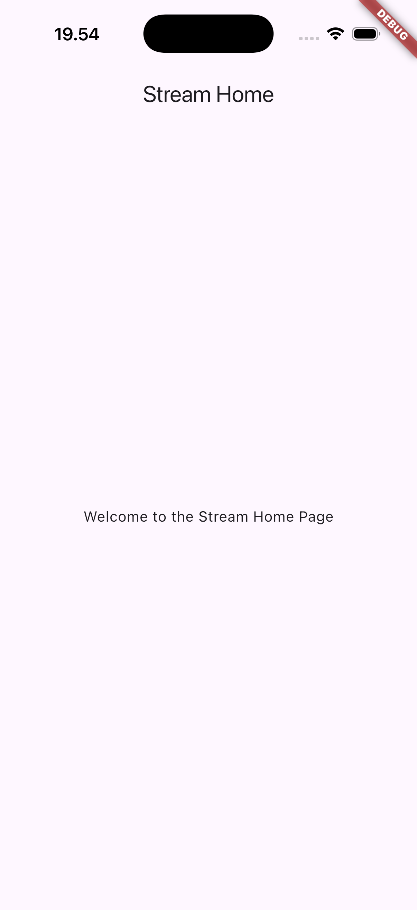
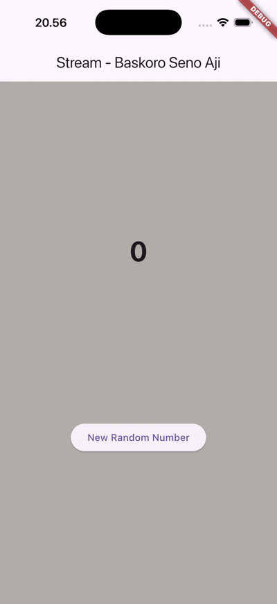
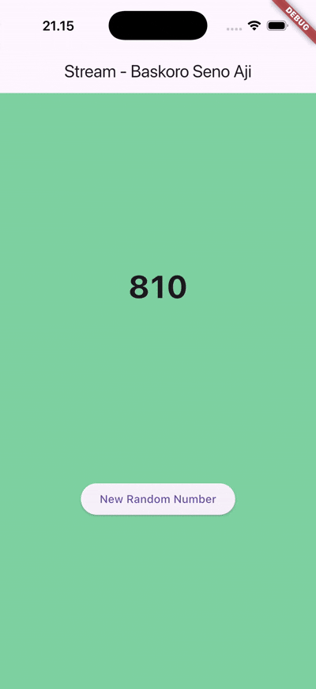
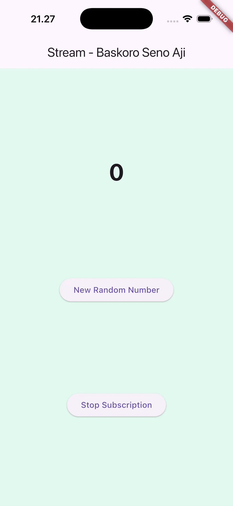

## **Praktikum 1 Dart Streams**
### **Soal 1** 
* Tambahkan nama panggilan Anda pada title app sebagai identitas hasil pekerjaan Anda.
* Gantilah warna tema aplikasi sesuai kesukaan Anda.
* Lakukan commit hasil jawaban Soal 1 dengan pesan "W12: Jawaban Soal 1"

### **Soal 2** 
* Tambahkan 5 warna lainnya sesuai keinginan Anda pada variabel colors tersebut.
* Lakukan commit hasil jawaban Soal 2 dengan pesan "W12: Jawaban Soal 2"
done it all.

### **Soal 3** 
* Jelaskan fungsi keyword yield* pada kode tersebut!
* Apa maksud isi perintah kode tersebut?
* Lakukan commit hasil jawaban Soal 3 dengan pesan "W12: Jawaban Soal 3"

The keyword yield* in that code is used inside an async* generator function to forward, or delegate, all values from another stream directly into the current stream. In this case, the getColors() method creates a periodic stream that emits a new color every second by cycling through a list of predefined colors using the index t % colors.length. Instead of yielding each value manually, yield* tells the generator to take everything produced by Stream.periodic and pass it through as if this stream generated the values itself. This makes the code cleaner and allows the getColors() method to continuously output colors in sequence without explicitly handling loops or event emission.

### **Soal 4**
* Capture hasil praktikum Anda berupa GIF dan lampirkan di README.

* Lakukan commit hasil jawaban Soal 4 dengan pesan "W12: Jawaban Soal 4"

### **Soal 5**
* Jelaskan perbedaan menggunakan listen dan await for (langkah 9) !
    * listen() uses a callback and allows the program to continue running while listening to stream events.
    * await for waits for each event in sequence, making the function process stream values one at a time like a loop.

* Lakukan commit hasil jawaban Soal 5 dengan pesan "W12: Jawaban Soal 5"

## **Praktikum 2 Stream controllers and sinks**
### **Soal 6** 
* Jelaskan maksud kode langkah 8 dan 10 tersebut!
    * Step 8: In this step, the initState() method is updated to initialize everything needed for working with the number stream. First, a new instance of NumberStream is created, and from it, the stream controller is retrieved so the widget can receive incoming values. The stream inside the controller is then accessed and immediately listened to using stream.listen(). Every time the stream emits a new number, the listener updates the UI by calling setState() and assigning the received value to lastNumber, ensuring the interface always displays the most recent number sent through the stream.

    * Step 10: In this step, a new method called addRandomNumber() is added to generate and send random numbers into the stream. The method begins by creating a Random object, then uses it to generate a random integer between 0 and 9 using nextInt(10). Once the number is generated, it is pushed into the stream using addNumberToSink(), allowing the stream listener in initState() to receive the new value and update the user interface accordingly.

* Capture hasil praktikum Anda berupa GIF dan lampirkan di README.
* Lalu lakukan commit dengan pesan "W12: Jawaban Soal 6".

### **Soal 7** 
* Jelaskan maksud kode langkah 13 sampai 15 tersebut!

    * Step 13: In this step, a new method called addError() is added inside stream.dart. This method sends an error event into the stream by calling controller.sink.addError('error'). Instead of sending a normal data value, this method allows you to intentionally trigger an error, which is useful for testing how the app reacts when something goes wrong inside the stream.

    * Step 14: In this step, the onError callback is added inside the listen method within initState() in the StreamHomePageState class. The main listener still updates the UI whenever a normal number arrives, but now the onError section gives the app a way to respond when the stream emits an error. When an error occurs, setState() is called to update the lastNumber value to -1, allowing the UI to clearly show that something unexpected happened in the stream.

    * Step 15: In this step, the addRandomNumber() method is edited so it no longer sends a random number into the stream. Instead, the two lines that generate and send a number are commented out, and the method now calls numberStream.addError(). This means every time the method is triggered, it intentionally sends an error event to the stream, allowing the app to test and display its error-handling behavior through the onError callback defined earlier.

* Kembalikan kode seperti semula pada Langkah 15, comment addError() agar Anda dapat melanjutkan ke praktikum 3 berikutnya.
* Lalu lakukan commit dengan pesan "W12: Jawaban Soal 7".

## **Praktikum 3 Injeksi data ke streams**
### **Soal 8** 
* Jelaskan maksud kode langkah 1-3 tersebut!
    
    * Step 1: In this step, a new variable named transformer is added inside the _StreamHomePageState class. This variable will later store a StreamTransformer, which acts as a middle layer between the original stream and the listener. Its purpose is to modify or filter the data flowing through the stream before it reaches the UI, allowing the app to transform incoming values, handle errors, or respond when the stream is closed.

    * Step 2: In this step, the transformer variable is initialized inside the initState() method using StreamTransformer.fromHandlers. This transformer intercepts every event coming from the stream and processes it through three handlers. The handleData handler takes each incoming value and multiplies it by 10 before sending it forward. The handleError handler receives any error from the stream and transforms it into a value of -1 instead of letting the error stop the stream. The handleDone handler ensures the sink is properly closed when the stream is finished. Altogether, this transformer customizes how the stream's data and errors behave before reaching the UI.

    * Step 3: In this step, still within initState(), the original stream is modified so that it flows through the newly created transformer before being listened to. This is done using stream.transform(transformer).listen(). As a result, every normal number that arrives is now multiplied by 10 before the UI receives it, and any error is converted into -1. The listener then updates the UI using setState() whenever transformed data or errors arrive, ensuring the app reflects the processed values rather than the raw ones from the stream.

* Capture hasil praktikum Anda berupa GIF dan lampirkan di README.
* Lalu lakukan commit dengan pesan "W12: Jawaban Soal 8".

## **Praktikum 4 Subscribe ke stream events**
### **Soal 9**
- Jelaskan maksud kode langkah 2, 6 dan 8 tersebut!
    *Step 2: In this step, the initState() method is updated so the widget begins actively listening to the number stream using stream.listen(). Each incoming value triggers setState(), which updates lastNumber and refreshes the UI. Errors are also handled here, ensuring that any issue in the stream results in lastNumber being set to -1.

    *Step 6: In this step, the dispose() method is enhanced by adding subscription.cancel(), which safely stops the stream listener when the widget is removed from the screen. This prevents memory leaks and ensures system resources are properly released.

    *Step 8: In this step, the addRandomNumber() method is modified so it first checks whether the stream controller is still open before sending new numbers. If the controller is closed, the UI updates lastNumber to -1; otherwise, a new random value is added to the stream, maintaining safe and controlled data flow.

- Capture hasil praktikum Anda berupa GIF dan lampirkan di README.
- Lalu lakukan commit dengan pesan "W12: Jawaban Soal 9".

## **Praktikum 5 Multiple stream subscriptions**
### **Soal 10**
- Jelaskan mengapa error itu bisa terjadi ?
    * The error "Bad state: Stream has already been listened to" occurs because a Stream in Dart/Flutter is fundamentally a single-subscription data channel by default, meaning that once the first listener begins consuming data from the Stream, that Stream is closed to any subsequent listeners, and any attempt to listen to it again will trigger this specific error. This typically happens when the Stream is created, listened to by one widget (perhaps in a method like initState() or a repeatedly called build() method), and then another attempt is made to subscribe to the exact same Stream instance later in the code, such as after a hot reload or in another part of the application lifecycle.

### **Soal 11**
- Jelaskan mengapa hal itu bisa terjadi ?

    * This behavior occurs because the application's Stream (likely handled by a StreamController) has more than one active listener simultaneously receiving data from the same source, or because the code processes each value sent to the Stream twice via two separate widgets or functions that are both subscribing to the Stream. Since the 'New Random Number' button sends a single new value to the Stream with each press, and that value appears twice, it indicates a duplicate processing of the Stream data, where the single value emitted by the Stream is displayed in the UI by two different operations tied to the same Stream, or the Stream has been converted to a broadcast Stream which allows multiple listeners, but the single value is processed by two separate listeners, causing each number to be appended twice.

- Capture hasil praktikum Anda berupa GIF dan lampirkan di README.
- Lalu lakukan commit dengan pesan "W12: Jawaban Soal 10,11"

## **Praktikum 5 Multiple stream subscriptions**
### **Soal 12**
- Jelaskan maksud kode pada langkah 3 dan 7 !

    * Step 3: The primary goal of Step 3 is to establish a continuous, asynchronous data source by defining the NumberStream class, which contains the getNumbers() method. This method is designated as an async* generator that utilizes yield* Stream.periodic to repeatedly execute a callback function every one second; inside this function, a new Random object generates an integer between 0 and 9, and this generated number is then sequentially emitted by the Stream, effectively creating a dedicated channel that constantly broadcasts a new random value every second.

    * Step 7: focuses on the crucial task of rendering the user interface (UI) based on the stream's output by implementing the StreamBuilder widget inside the build() method. The StreamBuilder is configured to subscribe directly to the previously created numberStream using initialData: 0 for the first render; its builder function acts as a reactive listener that checks the incoming snapshot status, and specifically uses the if (snapshot.hasData) condition to extract the latest integer value from the stream, which is then dynamically converted and displayed as a large text element at the center of the screen, guaranteeing that the UI updates immediately whenever a new number is broadcast.

- Capture hasil praktikum Anda berupa GIF dan lampirkan di README.
- Lalu lakukan commit dengan pesan "W12: Jawaban Soal 12".