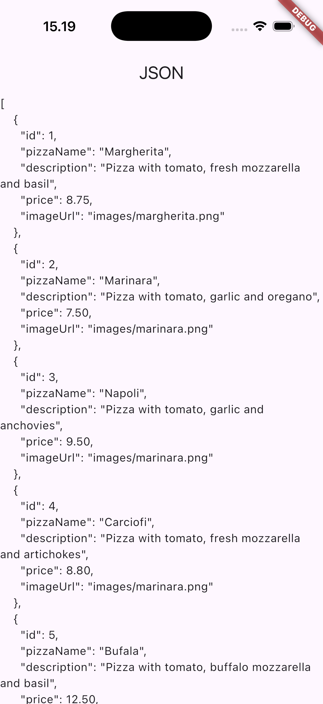
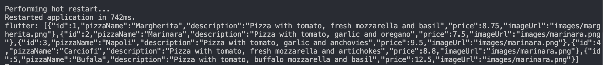
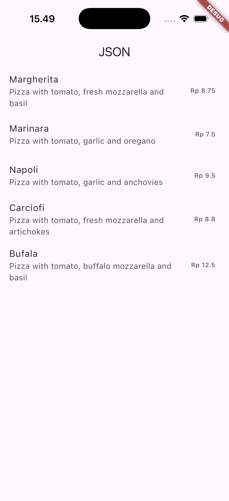
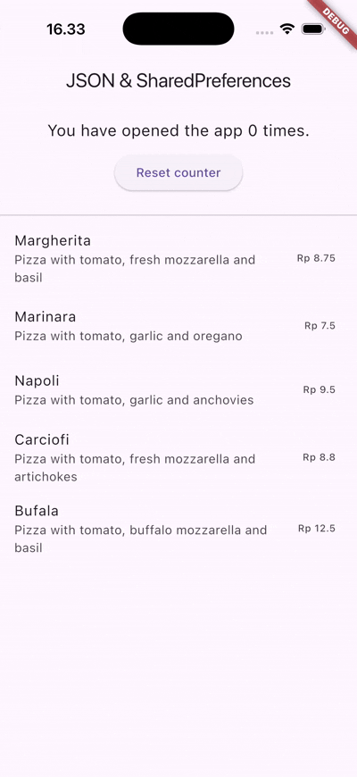
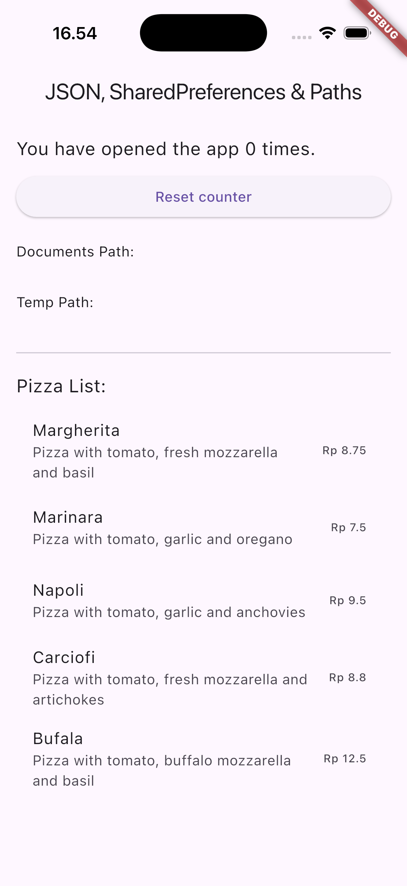
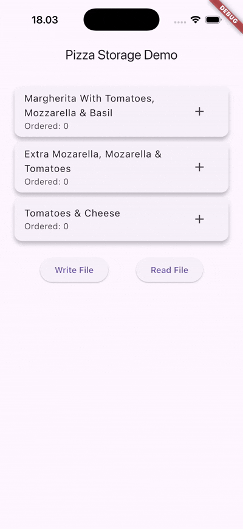
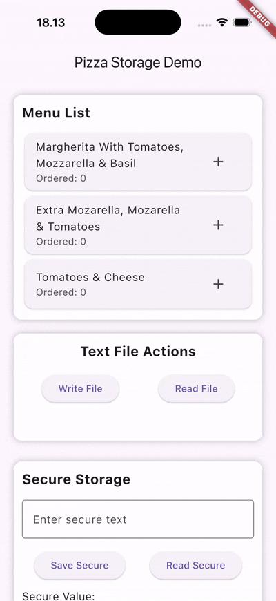

## **Praktikum 1: Konversi Dart model ke JSON**
### **Soal 1**
* Tambahkan nama panggilan Anda pada title app sebagai identitas hasil pekerjaan Anda.
* Gantilah warna tema aplikasi sesuai kesukaan Anda.
* Lakukan commit hasil jawaban Soal 1 dengan pesan "W13: Jawaban Soal 1"

= Done It! Change to red

### **Soal 2**
* Masukkan hasil capture layar ke laporan praktikum Anda.
* Lakukan commit hasil jawaban Soal 2 dengan pesan "W13: Jawaban Soal 2"

### **Soal 3**
* Masukkan hasil capture layar ke laporan praktikum Anda.
* Lakukan commit hasil jawaban Soal 2 dengan pesan "W13: Jawaban Soal 3"

## **Praktikum 2: Handle kompatibilitas data JSON**
### **Soal 4**
* Capture hasil running aplikasi Anda, kemudian impor ke laporan praktikum Anda!
* Lalu lakukan commit dengan pesan "W13: Jawaban Soal 4".

## **Praktikum 3: Menangani error JSON**
### **Soal 5**
* Jelaskan maksud kode lebih safe dan maintainable!
    * Safe Code : This code is considered safer because it prevents unexpected errors and avoids crashes by validating inputs, handling null values properly, and using safer parsing methods. It also anticipates edge cases, which means the application can still run smoothly even when the incoming data is incomplete or not in the expected format.

    * Maintable Code : This code is more maintainable because it is structured clearly, uses readable naming, and separates responsibilities into smaller, organized parts. As a result, future updates become easier, other developers can understand it quickly, and improvements can be made without breaking other sections of the system.

* Capture hasil praktikum Anda dan lampirkan di README.
* Lalu lakukan commit dengan pesan "W13: Jawaban Soal 5".

## **Praktikum 4: SharedPreferences**
### **Soal 6**
* Capture hasil praktikum Anda berupa GIF dan lampirkan di README.
* Lalu lakukan commit dengan pesan "W13: Jawaban Soal 6"

## **Praktikum 5: Akses filesystem dengan path_provider**
### **Soal 7**
* Capture hasil praktikum Anda dan lampirkan di README.
* Lalu lakukan commit dengan pesan "W13: Jawaban Soal 7".

## **Praktikum 6: Akses filesystem dengan path_provider**
### **Soal 8**
* Jelaskan maksud kode pada langkah 3 dan 7 !
    * In Step 3, I created the writeFile() function to save text into a file on my device. The function tries to write the string "Margherita, Capricciosa, Napoli" into the file using writeAsString(), and because it uses await, it finishes the writing process before continuing. If everything works, it returns true to show the file was written successfully; but if something goes wrong, the catch block prevents the app from crashing and instead returns false. This way, I can easily check whether the save worked and give feedback to the user.

    * In Step 7, if i pressed the read file button it will shown my name and my nim as well as the menu
* Capture hasil praktikum Anda berupa GIF dan lampirkan di README.
* Lalu lakukan commit dengan pesan "W13: Jawaban Soal 8".

## **Praktikum 7: Menyimpan data dengan enkripsi/dekripsi**
### **Soal 9**
* Capture hasil praktikum Anda berupa GIF dan lampirkan di README.
* Lalu lakukan commit dengan pesan "W13: Jawaban Soal 9".
