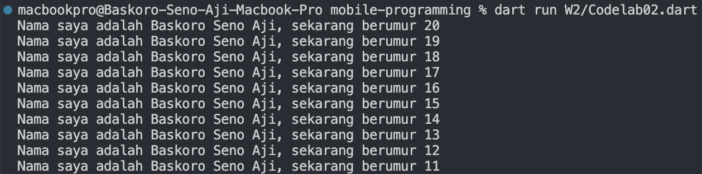
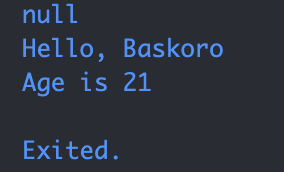

**== Question 1 ==**

Code Explanation: 

* void main() → This is the entry point of a Dart program. Every Dart program starts from the main() function.
* for (int i = 0; i < 10; i++) → This is a for loop that repeats 10 times, starting from i = 0 until i < 10.
* print(...) → This function prints text to the console.
* '${20 - i}' → This is string interpolation in Dart. It inserts the result of an expression (20 - i) into the string.

**== Question 2 ==**
*Why is it important to understand Dart before using Flutter?*

Because Flutter is built on top of the Dart programming language. Without understanding Dart basics, it would be difficult to:
* Build application logic
* Manage state, variables, and functions
* Create proper file, class, and widget structures

By learning Dart first, the Flutter learning process will be faster, more structured, and more efficient.

---

**== Question 3 ==**
*Key Points from Codelab:*

* Understanding Dart’s basic structure such as main(), print(), and for
* Learning about data types and variables
* Using loops with for
* Applying string interpolation with ${}
* Writing clean and descriptive code names
* Building a strong foundation before moving on to widgets and state management in Flutter
---

**== Question 4 ==**
Difference between *Null Safety* and *Late Variable* in Dart:

**Null Safety** → Ensures that variables are non-nullable by default, preventing runtime errors caused by null values.
**Late Variable** → A keyword used when you want to initialize a variable later, but you guarantee that it will be given a value before it’s used.

*Example :*
