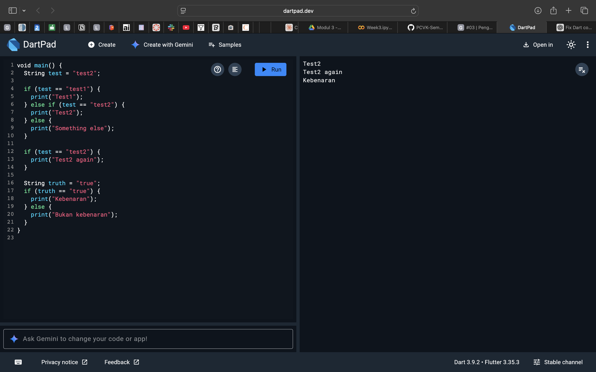

# *Praktikum 1: Menerapkan Control Flows ("if/else")*
## **Langkah 1-2**

### **Explanation :**
#### What Happens:
* Variable test is assigned the string "test2".
* The first if-else if-else block checks the value of test.
    * If it equals "test1" → it should print "Test1".
    * If it equals "test2" → it should print "Test2".
    * Otherwise → it should print "Something else".
* Since test is "test2", it should go into the second condition and print "Test2".
* Then, after the block, there’s another condition:

#### The Error : 
In step 1-2, the issue comes from Dart being a case-sensitive language, which means that keywords must be written exactly in the correct form. The correct syntax requires the keywords if and else to be written in all lowercase. However, in the code, If and Else were written with uppercase letters. Since Dart does not recognize these as valid keywords, the compiler will throw a syntax error, and as a result, the program will fail to compile.

## **Langkah 3**
### Error : 

#### Explanations : 
In step 3, the program defines a variable test with the value "true", which is a string, not a boolean. The code then tries to use if (test) as the condition in an if statement. This causes a problem because Dart requires the condition inside an if to evaluate to a boolean value (true or false), not a string. Since "true" is just text and not the boolean value true, the compiler will throw a type error and the program cannot run. The intended idea seems to be checking whether the variable equals "true", but in its current form, the code fails because a string cannot be directly used as a condition in Dart.

### Fix : 

#### Explanation :
* The program starts by declaring a variable test with the value "test2". The first if-else block checks this value. Since test is not equal to "test1", the first condition is skipped. The second condition test == "test2" evaluates to true, so the program prints "Test2".

* After that, there is another if statement outside the block. It again checks if test equals "test2". Because this condition is still true, the program prints "Test2 again".

* Next, the program declares a second variable named truth with the string value "true". An if-else statement is used to compare whether truth is equal to "true". Since the condition is true, the program prints "Kebenaran".

--- 

# *Praktikum 2: Menerapkan Perulangan "while" dan "do-while"*
## **Langkah 1**
### Error : 

#### Explanation : 
the Dart program shows several errors because the variable counter was used without being declared first. The compiler reports "Undefined name 'counter'" in multiple lines, meaning Dart does not recognize the variable since it was never initialized. This is a common error in Dart (and most programming languages) when you try to use a variable before declaring it. To fix this, you need to define the variable counter, for example with int counter = 0;, before using it in the while loop.

## **Langkah 2**
### Fix : 

#### Explanation : 
the error has been fixed by declaring int counter = 0; before the loop begins. The while loop runs as long as counter is less than 33. Inside the loop, the program prints the value of counter and then increments it by one using counter++. As a result, the output displays numbers from 0 to 32 in sequence on the right-hand side. This shows a correct implementation of the while loop where initialization, condition, and increment are clearly structured.

## **Langkah 3**

#### Explanation : 
the code combines a while loop and a do-while loop. First, the while loop prints values from 0 to 32, just like in the second example. Then, a do-while loop continues execution, starting from 33 up to 76. The difference between while and do-while is that do-while always executes at least once before checking the condition. This ensures that the value of counter is printed even if the condition is false at the start. The final output displays numbers sequentially from 0 up to 76.

--- 

# *Praktikum 3: Menerapkan Perulangan "for" dan "break-continue"*
## **Langkah 1**
### Error : 

#### Explanation : 
the error occurs because of inconsistent capitalization of the variable name in the for loop. Dart is a case-sensitive language, which means that index and Index are considered two completely different identifiers. In the code, the loop declaration used Index (with uppercase "I") in one place and index (with lowercase "i") in another. Since Dart cannot find a consistent definition, it throws errors like "Undefined name 'index'" and "Undefined name 'Index'". The error also includes "Setter not found: 'Index'", which happens because the compiler assumes Index might be a property or method, but it does not exist. This is why the program fails to run.

## **Langkah 2**
### Fix : 

#### Explanation :
the issue is fixed by using consistent lowercase naming (index) throughout the for loop. The variable is declared as int index = 10, and the same lowercase identifier is used in the condition (index < 27), increment (index++), and print statement (print(index)). Since Dart can now clearly recognize and track the same variable across the loop, the code compiles successfully. As a result, the output correctly displays the numbers from 10 to 26 in sequence. This demonstrates the importance of consistent naming and case sensitivity in Dart.

## **Langkah3** 
### Error : 

#### Explanation :
The error occurs because of inconsistent capitalization and syntax issues in my Dart code. I used If instead of if (Dart is case-sensitive, so these are different identifiers), referenced index before declaring it in the for loop, and had missing semicolons. The compiler threw "Undefined name 'index'" errors because it couldn't find consistent variable definitions, and "Expected ';' after this" errors due to improper syntax structure.

### Fix : 

#### Explanation : 
I corrected all the syntax errors by using lowercase if statements, properly declaring the loop variable as int index = 10, adding missing semicolons, and restructuring the conditional logic with correctly placed break and continue statements. The code now compiles without errors and outputs numbers 10-20.

--- 

# *Tugas Praktikum"*
Buatlah sebuah program yang dapat menampilkan bilangan prima dari angka 0 sampai 201 menggunakan Dart. Ketika bilangan prima ditemukan, maka tampilkan nama lengkap dan NIM Anda.

### Results : 

#### Explanations : 
My final working program successfully finds and displays prime numbers from 0 to 201. I implemented an isPrime() function that checks divisibility to determine if a number is prime, then used it in a loop to identify all primes. The output shows each prime number (2, 3, 5, 7, 11, 13, etc.) formatted with my name and NIM (2341720063), demonstrating the program runs correctly and identifies prime numbers as expected.
