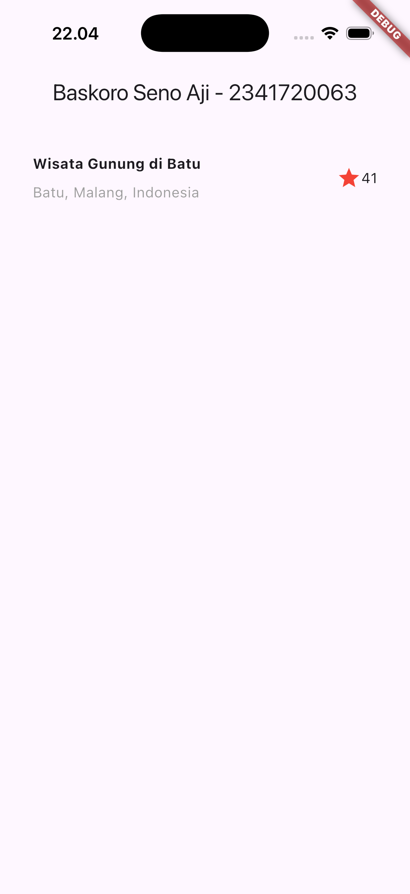
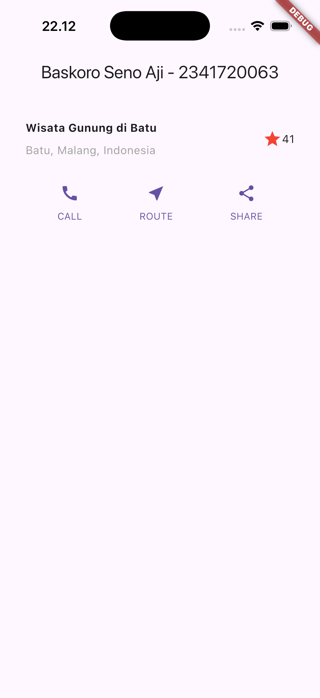
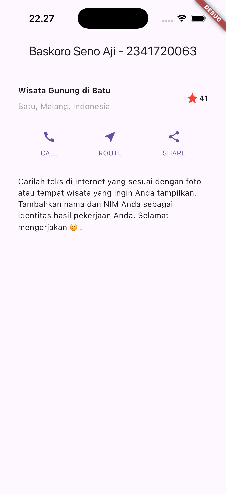
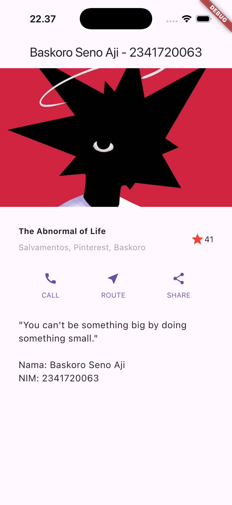

# *Tugas Praktikum 1*
## *Praktikum 1: Building Layout in Flutter*
### **Results**

#### **Explanation :**
##### What Happens:
At this stage, I created a new Flutter project and successfully ran the default counter app. The result shows that my Flutter environment is set up correctly and the app runs without any errors.

## *Praktikum 2: Implementing Button Row*
### **Results**

#### **Explanation :**
##### What Happens:
In the second praktikum, I added a row containing three buttons ("CALL", "ROUTE", "SHARE") with icons and labels. The result shows that the button row is displayed horizontally as intended.

## *Praktikum 3: Implementing Text Section*
### **Results**

#### **Explanation :**
##### What Happens:
At this stage, I added a text section containing a motivational quote and my personal information. The result shows that the text appears neatly below the button row, indicating that the text section was successfully implemented.

## *Praktikum 4: Implementing Image Section*
### **Results**

#### **Explanation :**
##### What Happens:
In the fourth praktikum, I added an image at the top of the layout using the Image widget. The result shows that the image is displayed properly above the title, button row, and text section, confirming that the image section is integrated into my app layout.