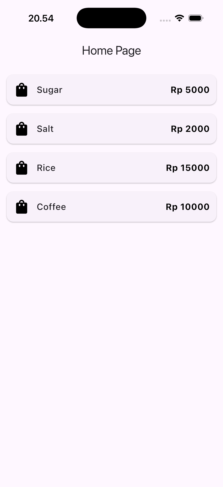
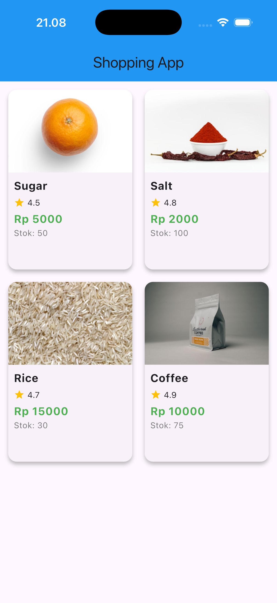
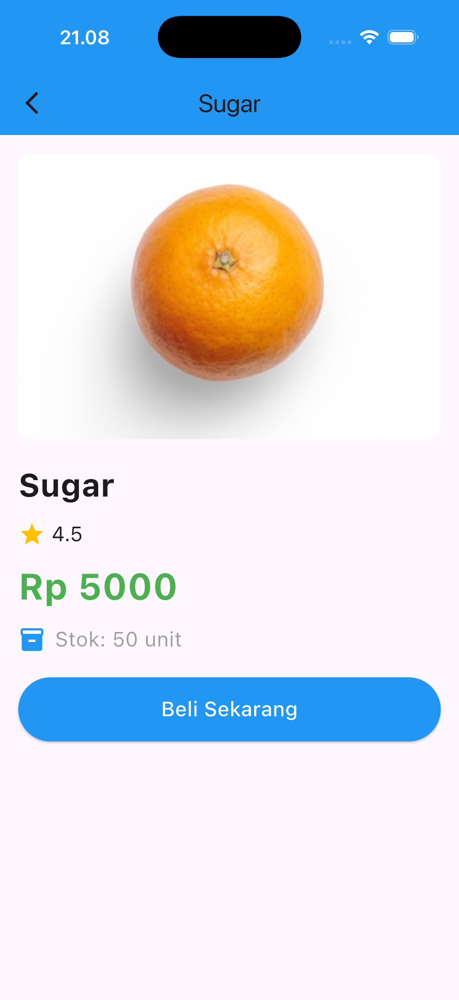

# *Practicum Task 1*
## *Practicum 1: Building Layout in Flutter*
### **Results**

#### **Explanation :**
##### What Happens:
At this stage, I created a new Flutter project and successfully ran the default counter app. The result shows that my Flutter environment is set up correctly and the app runs without any errors.

## *Practicum 2: Implementing Button Row*
### **Results**

#### **Explanation :**
##### What Happens:
In the second practicum, I added a row containing three buttons ("CALL", "ROUTE", "SHARE") with icons and labels. The result shows that the button row is displayed horizontally as intended.

## *Practicum 3: Implementing Text Section*
### **Results**

#### **Explanation :**
##### What Happens:
At this stage, I added a text section containing a motivational quote and my personal information. The result shows that the text appears neatly below the button row, indicating that the text section was successfully implemented.

## *Practicum 4: Implementing Image Section*
### **Results**

#### **Explanation :**
##### What Happens:
In the fourth practicum, I added an image at the top of the layout using the Image widget. The result shows that the image is displayed properly above the title, button row, and text section, confirming that the image section is integrated into my app layout.

# *Practicum Task 1*
### **Results** 

#### **Explanation :**
##### What Happens:
At this stage, I combined all the layout components I built previously: the image at the top, the title, the button row, and the text section. The final result shows a complete and consistent app layout, with all elements displayed harmoniously and responsively as intended.

## *Practicum 5: Implementing Image Section*
### **Results**

#### **Explanation :**
##### What Happens:
In this practicum, I added an image section to the shopping app. The result shows that the product image is clearly displayed on the main page, enhancing the visual appeal and strengthening the product identity.

# *Practicum Task 2*

## *1. Navigator*
### **Results** 

#### **Explanation :**
##### What Happens:
In this practicum, I implemented the Navigator feature to switch between pages. The result shows that when the navigation button is pressed, the app successfully transitions to the target page without any issues, confirming that the navigation system works properly.

## *2. Parsing Arguments*
### **Results** 

#### **Explanation :**
##### What Happens:
At this stage, I tested the argument parsing feature between pages. The result shows that the data sent from the previous page is received and displayed correctly on the target page, proving that data transfer between pages works as expected.

## *3. Grid View*
### **Results** 

#### **Explanation :**
##### What Happens:
In this practicum, I implemented a GridView to display a list of products in a grid format on the main page. The result shows products arranged neatly in a grid, and when a product is selected, its details appear on the next page. This confirms that the GridView and navigation to product details work well.

## *4. Hero Widget*
### **Results** 

#### **Explanation :**
##### What Happens:
At this stage, I added a Hero Widget animation for the product image transition from the grid page to the detail page. The result shows a smooth and attractive image transition animation, improving the app's user experience.

## *5. Footer with Name and Student ID*
### **Results** 

#### **Explanation :**
##### What Happens:
In the last practicum, I added a footer containing my name and student ID at the bottom of the app. The result shows the footer always displayed at the bottom of the screen, providing identity and a personal touch to the app's appearance.

## *6. Plugin GO-Route*
### **Results** 

#### **Explanation :**
##### What Happens:
In this practicum, I implemented navigation using the GoRouter plugin. The result shows that moving between pages is smoother and more organized compared to using the basic Navigator. With GoRouter, I can define all my routes and their parameters in a single configuration, making the code easier to read and maintain. The animation in the result demonstrates seamless transitions and proper argument passing between pages, which is especially useful for larger and more complex apps.

## Difference Between Navigator, Parsing Arguments, and GoRouter Plugin

### 1. Navigator
**Navigator** is the built-in Flutter widget for managing navigation between screens (routes). I use Navigator to push and pop pages manually, which means I have to write code to move from one screen to another and handle the navigation stack myself. It’s flexible but can get complex as my app grows.

### 2. Parsing Arguments
**Parsing Arguments** is the process of sending data between screens when navigating. With Navigator, I can pass arguments to the next page using the `push` method, and then retrieve them in the destination page. This is useful when I need to display details or pass user input between screens.

### 3. GoRouter Plugin
**GoRouter** is a third-party routing package for Flutter that simplifies navigation and argument passing. Unlike Navigator, GoRouter lets me define all routes and their parameters in one place, making the code cleaner and easier to manage, especially for larger apps. It also supports deep linking and more advanced navigation patterns out of the box.

### Summary Table

| Feature            | Navigator                | Parsing Arguments         | GoRouter Plugin              |
|--------------------|-------------------------|--------------------------|------------------------------|
| Navigation         | Manual (push/pop)       | Manual (with Navigator)  | Declarative (route config)   |
| Argument Passing   | Manual (via push)       | Manual (via push)        | Built-in (route params)      |
| Complexity         | Can get complex         | Adds code to Navigator   | Simplifies navigation        |
| Deep Linking       | Manual setup            | Manual setup             | Built-in support             |

**In my experience:**  
- Navigator is good for simple apps or when I need full control.  
- Parsing arguments is necessary when I want to send data between screens.  
- GoRouter makes navigation and argument passing much easier and is ideal for scalable apps.